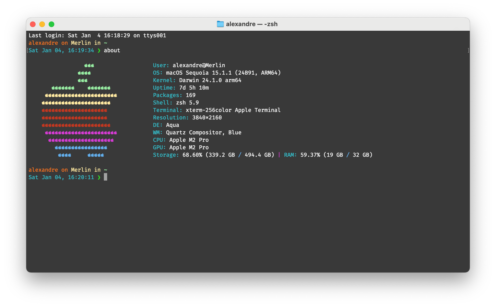

# about - A CLI Bash Information Tool for macOS
[![Version][version-badge]][version-url]
[![Platform][platform-badge]][platform-url]
[![Type][type-badge]][type-url]
[![License][license-badge]][license-url]

## What is _about_ ?

**about** is a _Bash Information Tool_ which will display an ASCII Apple logo with some valuable information about your OS at its right.  
This bash script lists the username, the OS and kernel versions, the used shell and terminal application as well as the CPU's and GPU's informations.

_This script is inspired by [ScreenFetch](https://github.com/KittyKatt/screenFetch) and by [Archey](https://github.com/djmelik/archey)._

[version-badge]: https://badgen.net/github/release/Harchytekt/learnIT/stable
[version-url]: https://github.com/Harchytekt/about/tree/v1.0
[platform-badge]: https://badgen.net/badge//macOS?icon=apple
[platform-url]: https://www.apple.com/macos/
[type-badge]: https://badgen.net/badge//terminal?icon=terminal
[type-url]: https://en.wikipedia.org/wiki/Terminal_(macOS)
[license-badge]: https://badgen.net/badge/license/GPL-3.0/2AB77E
[license-url]: https://github.com/Harchytekt/learnIT/blob/master/LICENSE
